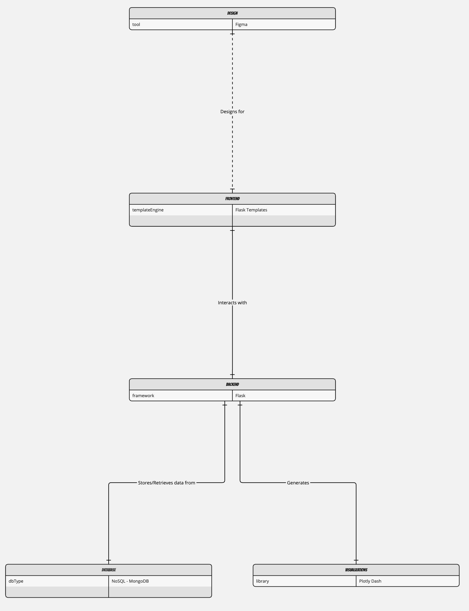
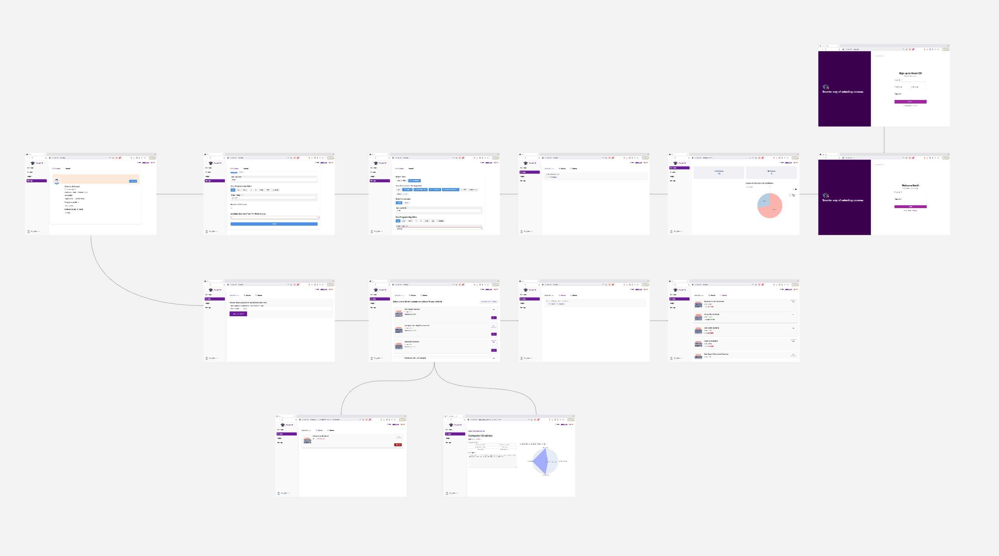
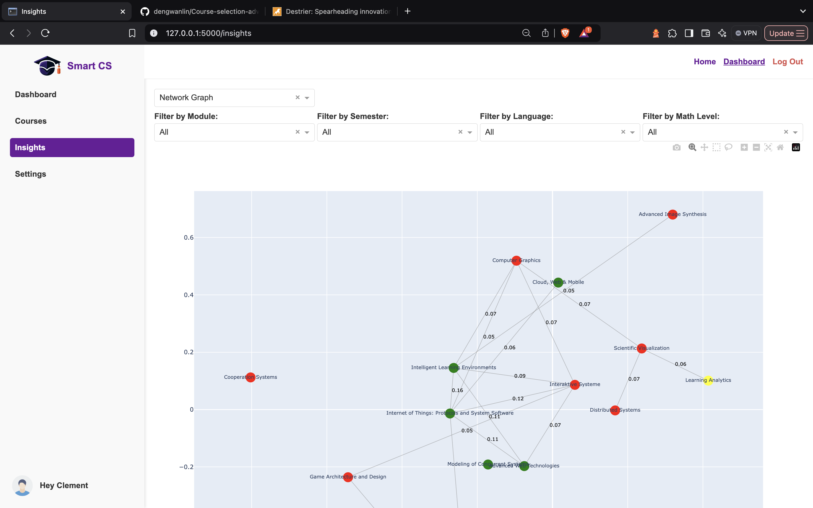
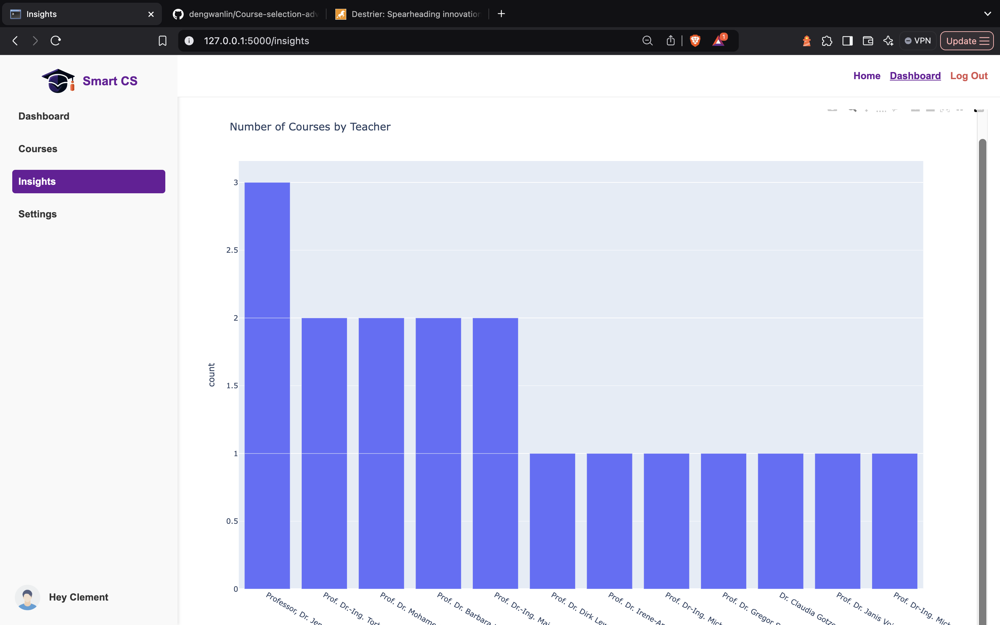
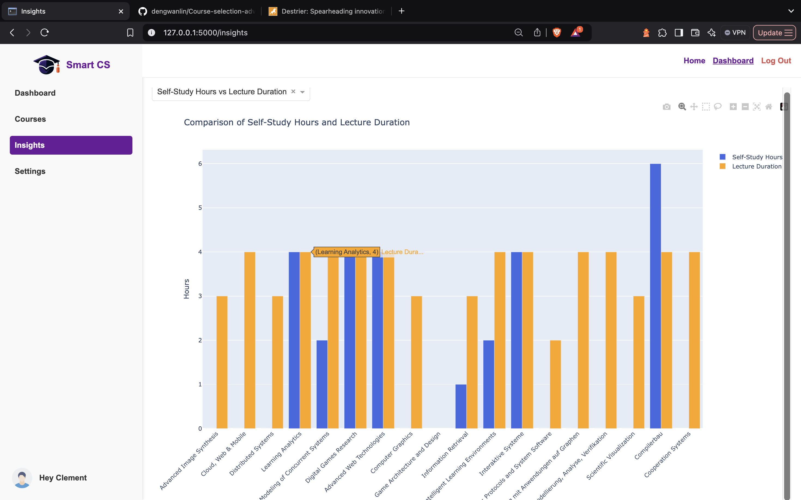

# SMART COURSE SELECTOR


## Table of Contents

- [About](#-about)
- [Architecture](#%EF%B8%8F-architecture)
- [Libraries and Algorithms](#-libraries-and-algorithms)
- [A Look at the App](#-a-look-at-the-app)
- [Running the app](#-running-the-app)
- [Demo](#-demo)
- [Feedback and Contributions](#-feedback-and-contributions)
- [Authors](#-authors)
- [License](#-license)

## 🚀 About

**Smart Course Selector** is an intelligent course recommendation tool designed to help students find courses that best match their preferences, interests, and academic goals. By analyzing various factors such as preferred semester, past programming experiences, language proficiency among others, the app provides personalized course recommendations to optimize the learning experience.

**Key Features**

- **Personalized Course Suggestions**: Tailored recommendations based on your unique learning preferences.
- **Interest & Concept-Based Selection**: Find courses that align with topics and subjects you enjoy.
- **Data-Driven Insights**: Leverages intelligent algorithms to provide meaningful and accurate recommendations.

## ⚙️ Architecture



## 📚 Libraries and Algorithms

Libraries and algorithms go here

## 📸 A Look at the App

### Application Flow



### Closer look at visualizations





## 📝 Running the app

To run the app locally, follow these steps:

```shell
# Open a terminal (Command Prompt or PowerShell for Windows, Terminal for macOS or Linux)

# Ensure Git is installed
# Visit https://git-scm.com to download and install console Git if not already installed

# Clone the repository
git clone https://github.com/dengwanlin/Course-selection-advisor.git

# Navigate to the project directory
cd Course-selection-advisor

# Install required libraries
pip install -r requirements.txt

# Contact any of the authors for our `.env` file to access the database
# Paste the `.env` file in the root of the  Course-selection-advisor folder

# Run app
python app.py

```

## 🤝 Demo

Demo goes here

## 🤝 Feedback and Contributions

> [!IMPORTANT]
> Whether you have feedback on features, have encountered any bugs, or have suggestions for enhancements, we're eager to hear from you. Your insights help us make the Smart Course Advisor better for students

We appreciate your support and look forward to making our product even better with your help!

## 👥 Authors

- Clement Ankomah - [@kojobaffoe011](https://github.com/@kojobaffoe011)
- Shafika Islam
- Haihua Wang
- Marta Zhao Ladrón de Guevara Cano
- Laura María García Pulido
- Hazem Al Massalmeh

## 📃 License

Distributed under the MIT License. See `LICENSE.txt` for more information.

[Back to top](#top)
