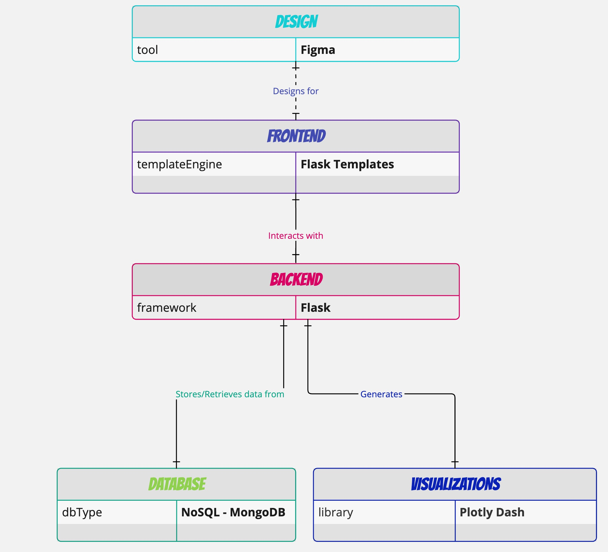

# SMART COURSE SELECTOR


## Table of Contents

- [About](#-about)
- [Architecture](#-architecture)
- [How to Build](#-how-to-build)
- [Documentation](#-documentation)
- [Feedback and Contributions](#-feedback-and-contributions)
- [License](#-license)
- [Contacts](#%EF%B8%8F-contacts)

## 🚀 About

**Smart Course Selector** is an intelligent course recommendation tool designed to help students find courses that best match their preferences, interests, and academic goals. By analyzing various factors such as preferred semester, past programming experiences, language proficiency among others, the app provides personalized course recommendations to optimize the learning experience.

**Key Features**

- **Personalized Course Suggestions**: Tailored recommendations based on your unique learning preferences.
- **Interest & Concept-Based Selection**: Find courses that align with topics and subjects you enjoy.
- **Data-Driven Insights**: Leverages intelligent algorithms to provide meaningful and accurate recommendations.

## 🎓 Architecture



## 📝 How to Build

To build the packages, follow these steps:

```shell
# Open a terminal (Command Prompt or PowerShell for Windows, Terminal for macOS or Linux)

# Ensure Git is installed
# Visit https://git-scm.com to download and install console Git if not already installed

# Clone the repository
git clone https://github.com/Abblix/Oidc.Server.git

# Navigate to the project directory
cd Oidc.Server

# Check if .NET SDK is installed
dotnet --version  # Check the installed version of .NET SDK
# Visit the official Microsoft website to install or update it if necessary

# Restore dependencies
dotnet restore

# Compile the project
dotnet build

```

## 📚 Documentation

### Getting Started

Explore the [Getting Started Guide](https://docs.abblix.com/docs/getting-started-guide).
In this guide, you will create a working solution step by step, building an OpenID Connect Provider using ASP.NET MVC and the Abblix OIDC Server solution.

To better understand the Abblix OIDC Server product, we recommend visiting our [Documentation](https://docs.abblix.com/docs) site. There, you will find useful information about the product and the OpenID Connect standard.

### Abblix OIDC Server Helper

The [**Abblix OIDC Server Helper**](https://chat.openai.com/g/g-1icXaNyOR-abblix-oidc-server-helper) is a specialized ChatGPT [](https://chat.openai.com/g/g-1icXaNyOR-abblix-oidc-server-helper) designed to assist users and developers working with the Abblix OIDC Server. This tool is equipped with comprehensive documentation and various supporting documents, enabling it to provide precise and detailed assistance on a range of topics. Here are the key areas it can help with:

- **Integration**: Guidance on how to integrate the Abblix OIDC Server with your .NET project.
- **Configuration**: Best practices and settings for configuring the server.
- **Technical Support**: Troubleshooting common issues and implementing features.
- **Licensing and Pricing**: Detailed information on different licensing plans and costs.
- **Features and Benefits**: Overview of the server's features and their advantages.
- **Security and Compliance**: Ensuring your implementation is secure and compliant with standards.
- **Extending and Customizing**: Guidelines for extending the functionality of the server.

and much more.

This tool is ideal for both new users and experienced developers seeking specific technical details or support.

## 🤝 Feedback and Contributions

We've made every effort to implement all the main aspects of the OpenID protocol in the best possible way. However, the development journey doesn't end here, and your input is crucial for our continuous improvement.

> [!IMPORTANT]
> Whether you have feedback on features, have encountered any bugs, or have suggestions for enhancements, we're eager to hear from you. Your insights help us make the Abblix OIDC Server library more robust and user-friendly.

Please feel free to contribute by [submitting an issue](https://github.com/Abblix/Oidc.Server/issues) or [joining the discussions](https://github.com/orgs/Abblix/discussions). Each contribution helps us grow and improve.

We appreciate your support and look forward to making our product even better with your help!

## 📃 License

This product is distributed under a proprietary license. You can review the full license agreement at the following link: [Standard License Agreement for Abblix OIDC Server](https://resources.abblix.com/docs/eng/standard-license-agreement-abblix-oidc-server.pdf).

For non-commercial use, this product is available for free.

## 🗨️ Contacts

For more details about our products, services, or any general information regarding the Abblix OIDC Server, feel free to reach out to us. We are here to provide support and answer any questions you may have. Below are the best ways to contact our team:

- **Email**: Send us your inquiries or support requests at [support@abblix.com](mailto:support@abblix.com).
- **Website**: Visit the official Abblix OIDC Server page for more information: [Abblix OIDC Server](https://www.abblix.com/abblix-oidc-server).

Subscribe to our LinkedIn and Twitter:

[![LinkedIn](https://img.shields.io/badge/subscribe-white.svg?logo=data:image/svg%2bxml;base64,PHN2ZyB2aWV3Qm94PSIwIDAgMjQgMjQiIHhtbG5zPSJodHRwOi8vd3d3LnczLm9yZy8yMDAwL3N2ZyI+PHBhdGggZD0iTTIwLjQ0NyAyMC40NTJoLTMuNTU0di01LjU2OWMwLTEuMzI4LS4wMjctMy4wMzctMS44NTItMy4wMzctMS44NTMgMC0yLjEzNiAxLjQ0NS0yLjEzNiAyLjkzOXY1LjY2N0g5LjM1MVY5aDMuNDE0djEuNTYxaC4wNDZjLjQ3Ny0uOSAxLjYzNy0xLjg1IDMuMzctMS44NSAzLjYwMSAwIDQuMjY3IDIuMzcgNC4yNjcgNS40NTV2Ni4yODZ6TTUuMzM3IDcuNDMzYTIuMDYyIDIuMDYyIDAgMCAxLTIuMDYzLTIuMDY1IDIuMDY0IDIuMDY0IDAgMSAxIDIuMDYzIDIuMDY1em0xLjc4MiAxMy4wMTlIMy41NTVWOWgzLjU2NHYxMS40NTJ6TTIyLjIyNSAwSDEuNzcxQy43OTIgMCAwIC43NzQgMCAxLjcyOXYyMC41NDJDMCAyMy4yMjcuNzkyIDI0IDEuNzcxIDI0aDIwLjQ1MUMyMy4yIDI0IDI0IDIzLjIyNyAyNCAyMi4yNzFWMS43MjlDMjQgLjc3NCAyMy4yIDAgMjIuMjIyIDBoLjAwM3oiIGZpbGw9IiMwQTY2QzIiLz48cGF0aCBzdHlsZT0iZmlsbDojZmZmO3N0cm9rZS13aWR0aDouMDIwOTI0MSIgZD0iTTQuOTE3IDcuMzc3YTIuMDUyIDIuMDUyIDAgMCAxLS4yNC0zLjk0OWMxLjEyNS0uMzg0IDIuMzM5LjI3NCAyLjY1IDEuNDM3LjA2OC4yNS4wNjguNzY3LjAwMSAxLjAxYTIuMDg5IDIuMDg5IDAgMCAxLTEuNjIgMS41MSAyLjMzNCAyLjMzNCAwIDAgMS0uNzktLjAwOHoiLz48cGF0aCBzdHlsZT0iZmlsbDojZmZmO3N0cm9rZS13aWR0aDouMDIwOTI0MSIgZD0iTTQuOTE3IDcuMzc3YTIuMDU2IDIuMDU2IDAgMCAxLTEuNTItMi42NyAyLjA0NyAyLjA0NyAwIDAgMSAzLjQxOS0uNzU2Yy4yNC4yNTQuNDIuNTczLjUxMi45MDguMDY1LjI0LjA2NS43OCAwIDEuMDItLjA1MS4xODYtLjE5Ny41MDQtLjMuNjUyLS4wOS4xMzItLjMxLjM2Mi0uNDQzLjQ2NC0uNDYzLjM1Ny0xLjEuNTAzLTEuNjY4LjM4MlpNMy41NTcgMTQuNzJWOS4wMDhoMy41NTd2MTEuNDI0SDMuNTU3Wk05LjM1MyAxNC43MlY5LjAwOGgzLjQxMXYuNzg1YzAgLjYxNC4wMDUuNzg0LjAyNi43ODMuMDE0IDAgLjA3LS4wNzMuMTI0LS4xNjIuNTI0LS44NjUgMS41MDgtMS40NzggMi42NS0xLjY1LjI3NS0uMDQyIDEtLjA0NyAxLjMzMi0uMDA5Ljc5LjA5IDEuNDUxLjMxNiAxLjk0LjY2NC4yMi4xNTcuNTU3LjQ5My43MTQuNzEzLjQyLjU5Mi42OSAxLjQxMi44MDggMi40NjQuMDc0LjY2My4wODQgMS4yMTUuMDg1IDQuNTc4djMuMjU4aC0zLjUzNnYtMi45ODZjMC0yLjk3LS4wMS0zLjQ3NC0uMDc0LTMuOTA4LS4wOS0uNjA2LS4zMTQtMS4wODItLjYzNC0xLjM0Mi0uMzk1LS4zMjItMS4wMjktLjQzNy0xLjcwMy0uMzA5LS44NTguMTYzLTEuMzU1Ljc1LTEuNTIzIDEuNzk3LS4wNzYuNDcxLS4wODQuODQ1LS4wODQgMy44MzR2Mi45MTRIOS4zNTN6Ii8+PC9zdmc+)](https://www.linkedin.com/company/103540510/)
[](https://twitter.com/OIDCServer)

We look forward to assisting you and ensuring your experience with our products is successful and enjoyable!

[Back to top](#top)
